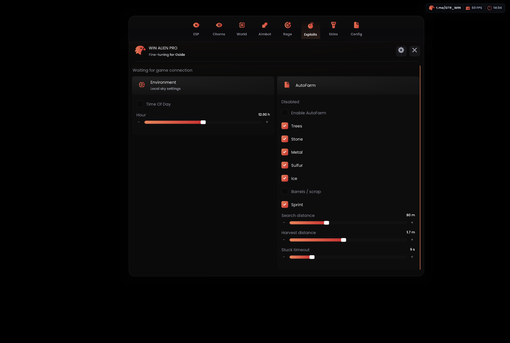
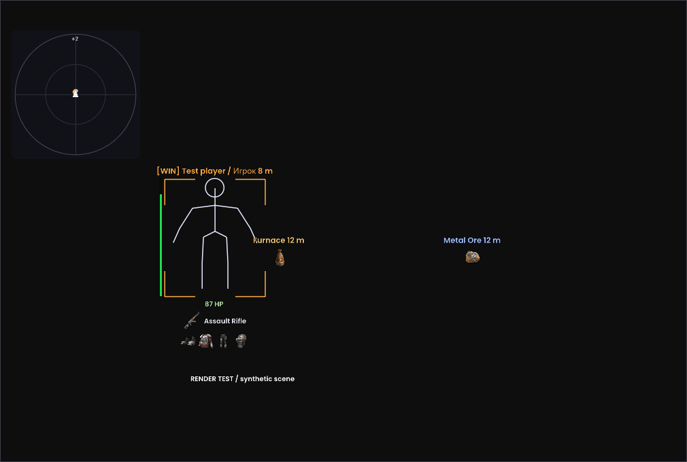
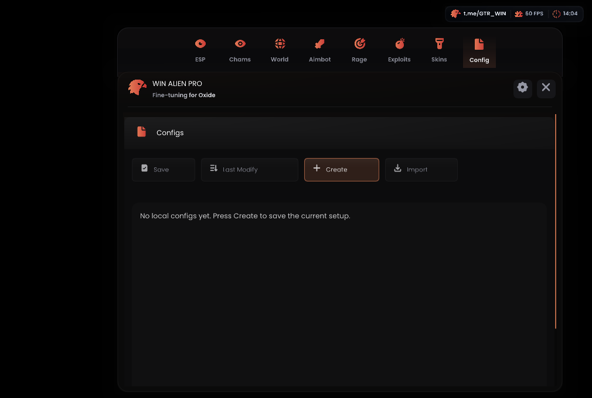

# WIN ALIEN — Oxide External

Лоадер для ПК и Android external под Oxide 1.13.11924 x86_64 в MSI App Player/BlueStacks.

**[Скачать OxideLoader.exe 0.2.11](https://github.com/asiriswin-bit/WINALIEN-Oxide-External/releases/download/oxide-11924-v0.2.11/OxideLoader.exe)** · [Релиз](https://github.com/asiriswin-bit/WINALIEN-Oxide-External/releases/tag/oxide-11924-v0.2.11)

## Изменения 0.2.11

- Aim: отдельные фильтры игроков/NPC, чтение моделей NPC, резервный источник Head/Chest из hitbox. Новая дистанция по умолчанию — 300 м; старый CFG сохраняет выбранное значение.
- AutoFarm: выбор ресурса под инструмент, подход, обычная атака, переход к следующему ресурсу и пропуск застрявшей цели. Деревья, камень, металл, сера, лёд и добываемый scrap; настройки дальности, спринта и тайм-аута.
- Silent (experimental): отдельное направление hitscan без записи углов камеры. Стабильность попаданий в игре пока не подтверждена.
- Рамки игроков по проекции костей с учётом позы. HP, подписи и экипировка располагаются относительно той же рамки. Без доступных костей остаётся приблизительная рамка.
- Лежащие предметы по умолчанию: иконка и дистанция без названия. Все новые настройки сохраняются в CFG.
- Aim и AutoFarm выключены по умолчанию; открытое меню приостанавливает их работу. Временные ошибки чтения/записи не теряют ожидающее восстановление ввода.

## Обновление

1. Останови external старым лоадером и закрой его.
2. Замени **OxideLoader.exe**. Кнопка «Скачать файлы» не обновляет сам EXE.
3. Нажми «Скачать файлы», дождись `oxide-11924-v0.2.11`, затем «Старт external».
4. Aim: Aimbot → Enable Aim → Camera или Silent (experimental) → выбери кость, FOV и дистанцию → закрой меню. While ADS требует игрового прицеливания; Smooth относится к Camera.
5. AutoFarm: возьми подходящий инструмент → Exploits → AutoFarm → выбери ресурсы → закрой меню. Он идёт прямо к цели, без обхода стен. Смена инструмента вручную.
6. Если загружен старый CFG, проверь Aim → Distance и World → Items → Icons: сохранённые значения не сбрасываются. Дистанция у иконок остаётся при включённом Distances.

Протокол **6**: EXE и бинарник обновляются вместе. Старые настройки сохраняются. World поддерживает текст/иконки/оба, дистанцию, цвет, размер, разрежение и лимит объектов. В Config именованные пресеты хранятся отдельно от автоматического сохранения текущих настроек. Экспорт: `/data/local/tmp/configs/exports/`; импорт: `.cfg` из `/data/local/tmp/configs/imports/`. Облачные share-коды не подключены.

Крестик/Escape скрывают меню; watermark и Insert открывают его. F6 переключает ESP. Меню и ESP работают внутри эмулятора через SurfaceControl + EGL/OpenGL ES 3; Windows ImGui/DX11 используется лоадером. Для MSI используется встроенный `/system/xbin/bstk/su`; активационный ключ не нужен.

## Проверки и ограничения

Все 14 наборов CTest прошли. Smoke при 100% и 150% завершился успешно, по 34 проверки взаимодействия с меню. Локальные проверки охватывают чтение сцены и моделей NPC, выбор дальней цели, FOV и сглаживание, запись и восстановление ввода, переход между ресурсами, рамки по позе, CFG, загрузку и нажатия меню. Скриншоты выше получены на синтетических данных.

**Новые функции 0.2.11 ещё не проверены в игре: подключённого эмулятора нет.** Запись направления Silent конкурирует с игровым обновлением и не синхронизирована с выстрелом; попадания и серверное подтверждение не проверены. AutoFarm использует прямое движение и штатную атаку. Исправление дальней дистанции Aim требует игрового теста; подтверждённый запрет NPC в фильтре убран.

Visible Check, AutoFire, Auto Kill и свободная камера не реализованы. Обход античита не заявляется.

## Компоненты

Репозиторий содержит описание и бинарники. Исходники соответствующей сборки находятся в отдельном архиве у владельца проекта. Ресурсы и адаптер поверхности предоставленного Overlay — GPLv3, Dear ImGui — MIT. См. [THIRD-PARTY-NOTICES.txt](THIRD-PARTY-NOTICES.txt); Platform Tools сопровождаются NOTICE.txt.
