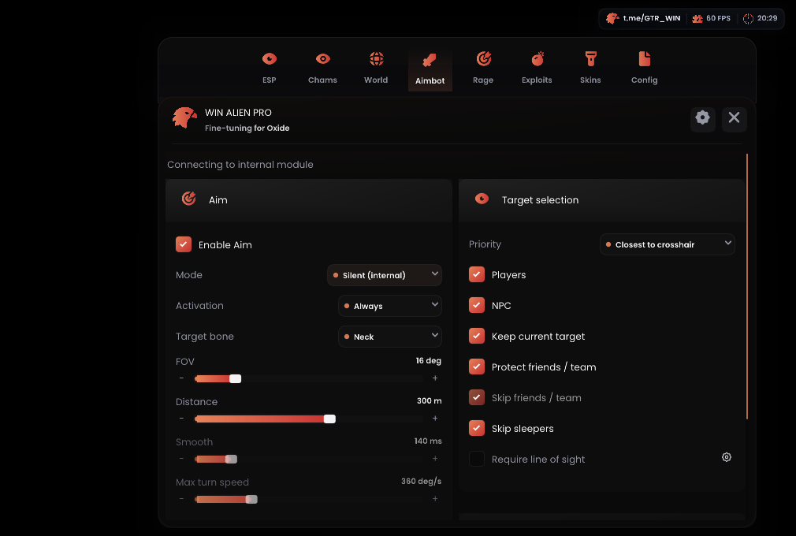

# WIN ALIEN — Oxide External

Лоадер для ПК и Android external под Oxide 1.13.11924 x86_64 в MSI App Player/BlueStacks.

**[Скачать OxideLoader.exe 0.2.15](https://github.com/asiriswin-bit/WINALIEN-Oxide-External/releases/download/oxide-11924-v0.2.15/OxideLoader.exe)** · [Релиз](https://github.com/asiriswin-bit/WINALIEN-Oxide-External/releases/tag/oxide-11924-v0.2.15)

## Изменения 0.2.15

У тестера 0.2.14 запускался external, но `dlopen` возвращал ошибку: внутренний модуль не загружался. В логах есть `uid=0`, поэтому проблема не объясняется отсутствием прав root.

Исправлено сохранение `dlerror` до завершения потока. Удалён fallback обычного `dlopen`, который терял выбранный контекст загрузки игры; добавлен поиск `__loader_dlopen` в проверенном ELF linker64. Лоадер пишет версию и путь runtime, проверяет комплектность до остановки external. Статус модуля записывается и без соединения.

**Точная причина первоначального отказа неизвестна: 0.2.14 потеряла её текст. Успех 0.2.15 в игре пока не подтверждён.** После полного перезапуска Oxide и обновления EXE/runtime нужна новая попытка загрузки и оба журнала.

## Внутренний модуль 0.2.14

- Внутренний модуль для Silent: направление меняется непосредственно во время игровой функции выстрела и восстанавливается после неё. Сохраняются FOV, дистанция, выбор кости, фильтры друзей/NPC, активация и фиксация цели.
- Visible Check через физику игры до головы и груди. При Require line of sight Silent дополнительно проверяет выбранную кость в момент выстрела.
- Проверка версии игры, свежести настроек и текущей цели. Установка двух перехватов с остановкой потоков, проверкой исходных и подготовленных инструкций и откатом при ошибке записи.
- Модуль загружается по требованию. Меню, ESP, Camera Aim, AutoFarm и обычный Auto Melee сохраняют прежнюю схему.

**Загрузка модуля в тестах 0.2.14 завершилась отказом; результат 0.2.15 ещё не проверен.** Счётчик подмен не является счётчиком попаданий. Игровой разброс сохраняется; обход античита не заявляется.

## Сохранено из 0.2.13

- ESP: отдельные цвета имени, бокса, заливки, расстояния, линий, оружия и экипировки; толщина бокса и HP-бара. Имя и бокс белые по умолчанию, оружие — иконкой, HP-текст выключен.
- Линии мира отдельно для каждой категории: включение, начало, цвет и толщина. Переключатель линий игроков больше не включает линии ресурсов.
- Резервное чтение загруженной экипировки модели, вертикальное расположение и цвет иконок. Неподтверждённые значения HP других игроков скрыты.
- AutoFarm: чтение крестиков дерева/руды и движение к текущей отметке, сохранение и восстановление существующих значений движения. При отсутствии отметки используется начальная точка удара. Причина отказа инструмента отображается отдельно.
- Исправлен сброс Aim бездействующим AutoFarm. Отдельная активация Silent по умолчанию Always; режим обычного Aim сохраняется независимо.
- Auto Melee: выбор головы, шеи, груди или таза. Fast Reload: клиентский множитель до 50×.

Внешний цикл Silent из 0.2.13 отключён: новая реализация использует callback выстрела внутри процесса игры.

## Обновление и запуск

1. Остановить external, полностью закрыть Oxide и старый лоадер, заменить EXE. «Скачать файлы» обновляет runtime, не сам EXE.
2. Скачать runtime `oxide-11924-v0.2.15`, затем запустить игру и «Старт external». **EXE и runtime обновляются вместе:** старый EXE не понимает расширенный список файлов. Для замены загруженного модуля нужен перезапуск игры.
3. ESP → Player Core → **Clean ESP preset** сбрасывает только оформление. Шестерёнки открывают настройки элементов и категорий. Старые CFG автоматически отключают HP-текст, подписи оружия, category/net ID и линии мира.
4. AutoFarm: взять подходящий топор/кирку, выбрать ресурсы и включить функцию, закрыть меню. Если движения нет, статус показывает ожидание инструмента, цели, управления или свежей сцены.
5. Auto Melee: Rage → Auto Melee → инструмент ближнего боя → кость, дальность/FOV → включить и закрыть меню.
6. Auto Heal: лекарства в hotbar; Exploits → Calibrate hotbar + use → центры первого/последнего слота и Use. После изменения разрешения повторить калибровку. Учитываются игровые откаты предмета.

Меню скрывается крестиком/Escape, открывается watermark/Insert. F6 переключает ESP. Именованные CFG: Config → Create / Save / Load. Friends / Team исключает друзей из Aim и Auto Melee; блокировка дружественного огня экспериментальная.

## Проверки и ограничения

17/17 наборов CTest; smoke интерфейса при 100% и 150%. Машинный код загрузки проверен в Unicorn на 27 сценариях. Скриншоты показывают синтетический рендер. **Изменения 0.2.15 ещё не проверены в игре: эмулятор не подключён.**

Для первого теста: Aim → Silent (internal) → Always → включить Aim → закрыть меню. Проверить цель в круге и фактический урон. Visible Check проверить на открытой цели и той же цели за стеной. Сохранить журнал кнопкой лоадера: `internal_hooks=committed count=2` и `hooks=3` подтверждают установку, `shots`/`redirected` — вызовы и подмены, но не урон.

Silent Farm/Melee без анимаций, skip animations, свободная камера и автостройка не реализованы. Visible Check ограничен 128 ближайшими целями в пределах дистанции Aim. Auto Melee использует обычную атаку, AutoFarm движется прямо и не строит маршрут в обход стен. Множитель Reload не гарантирует мгновенную перезарядку на сервере.

## Компоненты

Репозиторий содержит описание и бинарники. Исходники соответствующей сборки находятся в отдельном архиве у владельца проекта. Ресурсы и адаптер поверхности предоставленного Overlay — GPLv3, Dear ImGui — MIT, Dobby — Apache-2.0. См. [THIRD-PARTY-NOTICES.txt](THIRD-PARTY-NOTICES.txt); Platform Tools сопровождаются NOTICE.txt.
