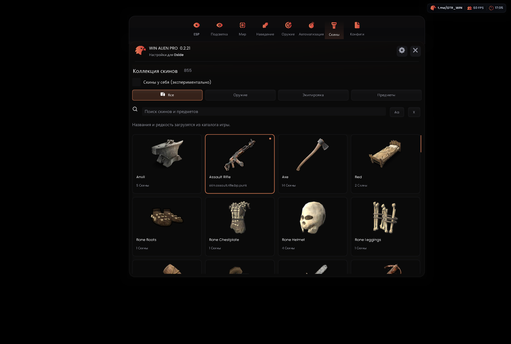

# WIN ALIEN — Oxide external

Диагностическая **0.2.23**: [релиз и архивы](https://github.com/asiriswin-bit/WINALIEN-Oxide-External/releases/tag/oxide-11924-v0.2.23).

Повторно сверены дамп и машинный код 11924 x86_64: 33 опорные инструкции совпали. В журнал добавлены причины ранних отказов и адреса методов продолжения, которые прежняя диагностика не показывала. Причина отсутствия применения скинов пока не установлена; эта сборка предназначена для её проверки. Сборка и 20/20 локальных тестов пройдены.

Скачай [новый OxideLoader.exe 0.2.23](https://github.com/asiriswin-bit/WINALIEN-Oxide-External/releases/download/oxide-11924-v0.2.23/OxideLoader.exe) или Online ZIP в новую папку: runtime и атлас загрузятся с GitHub с проверкой SHA-256. Для запуска с локальными файлами есть полный PC ZIP. Старый EXE закреплён за своей версией и не скачает 0.2.23. Вспомогательный github-release.txt не нужен.

Включи «Скины у себя», выбери скин, закрой меню и переключи оружие туда-обратно. Для одежды сними и повторно надень предмет. Карточка сохраняет выбор сразу; отдельной кнопки «Применить» нет. После проверки сохрани oxide-runtime.log кнопкой лоадера.

Каталог: 855 скинов для 70 предметов, 724 превью. Применение оружия/экипировки экспериментальное; для построек доступен просмотр коллекции. Профиль Oxide 1.13.11924 x86_64 для MSI App Player / BlueStacks. Внутренний модуль не загружается.

Русский язык: **Settings → последняя карточка Language → Русский**. Для новых стандартных цветов и расположения ESP нажми **ESP → Clean ESP preset / Сбросить стиль ESP**. Сохранённые пользовательские конфиги автоматически не перезаписываются.

Для подбора лута открой настройки рядом с **AutoFarm → Собирать выпавший лут**. По отдельности укажи три игровые кнопки: список лута, «Собрать всё», закрытие списка. Открывай нужную игровую панель до указания её кнопок. Координаты сохраняются в CFG для текущего разрешения. При неподобранном луте автофарм остановится; проверь место в инвентаре и настройку кнопок.

Обмундирование по умолчанию сверху над ником, оружие снизу; для каждого выбирается сторона. Скелет белый, контур головы выключен. Видимость определяется по отрисовке модели, одежды и LOD; это приблизительный сигнал, не физическая проверка препятствия. Silent camera у ближнего боя сохраняет видимый ракурс, но штатная анимация удара остаётся. Антизастревание пробует шаги в стороны и прыжки, затем пропускает недоступную цель; полноценного поиска пути нет.

Исходники — `OxideExternal-11924-source.zip`. Сборка: `powershell -File build.ps1` с Visual Studio C++ Desktop, CMake и Android NDK r27c. `-SkipPayload` пропускает Android-сборку, `-SkipTests` пропускает CTest. ARM64-бинарник собирается для совместимости пакета; игровые функции этого релиза рассчитаны на x86_64.

[Скачать лоадер 0.2.23](https://github.com/asiriswin-bit/WINALIEN-Oxide-External/releases/download/oxide-11924-v0.2.23/OxideLoader.exe)

