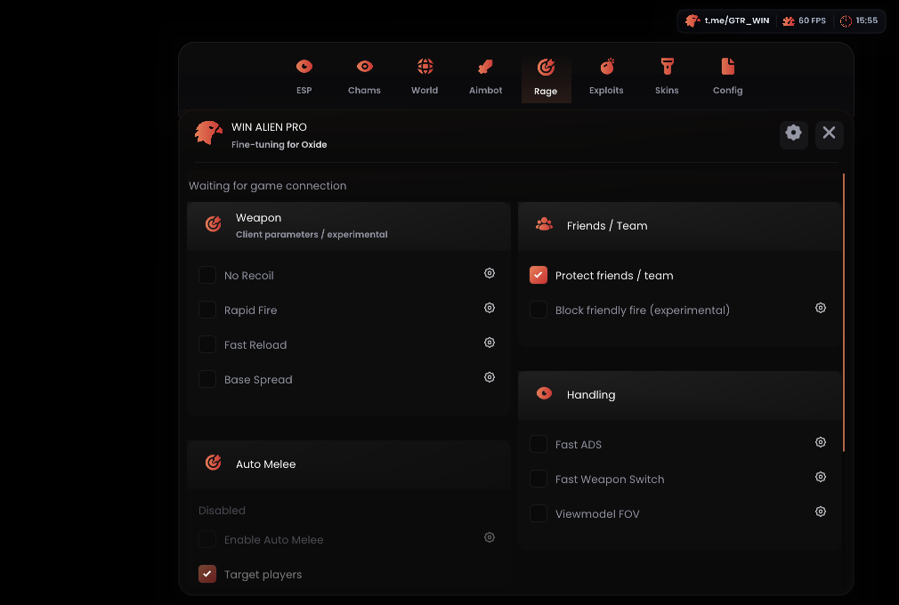

# WIN ALIEN — Oxide External

Лоадер для ПК и Android external под Oxide 1.13.11924 x86_64 в MSI App Player/BlueStacks.

**[Скачать OxideLoader.exe 0.2.12](https://github.com/asiriswin-bit/WINALIEN-Oxide-External/releases/download/oxide-11924-v0.2.12/OxideLoader.exe)** · [Релиз](https://github.com/asiriswin-bit/WINALIEN-Oxide-External/releases/tag/oxide-11924-v0.2.12)

## Изменения 0.2.12

- Auto Heal: пороги HP, выбор бинтов/аптечек, приоритет лекарства, калибровка слотов и Use. Учитывает откат предмета; прекращает неудачные повторные клики.
- Friends / Team: признаки друга и команды, настраиваемый зелёный ESP, исключение из Aim и Auto Melee. Отдельная экспериментальная блокировка дружественного огня.
- Auto Melee: ближайший противник, Players/NPC, дальность, FOV до 360°. Поворот камеры и обычный удар инструментом при совпадении игрового ray с целью в пределах досягаемости оружия.
- Visible Check (crosshair): подтверждение цели под прицелом. Видимость остальных игроков неизвестна; это не полная проверка всех препятствий.
- Настройки сохраняются в CFG. Auto Heal, Auto Melee и блокировка дружественного огня по умолчанию выключены. При лечении AutoFarm и Aim приостанавливаются.

## Запуск новых функций

1. Остановить external, закрыть старый лоадер, заменить EXE. Кнопка «Скачать файлы» обновляет runtime, не сам EXE.
2. Скачать runtime `oxide-11924-v0.2.12`, затем «Старт external». **Протокол 7 — EXE и runtime обновляются вместе.**
3. Автохил: положить лекарство в hotbar, выбрать его, чтобы появилась Use. Exploits → Auto Heal → Calibrate hotbar + use → отметить центры первого/последнего слота и Use. Задать HP, включить, закрыть меню. После изменения разрешения или кнопок повторить калибровку.
4. Auto Melee: Rage → Auto Melee → взять кирку/топор/другое ближнее оружие → настроить дальность/FOV и включить → закрыть меню.
5. Цвет друзей: ESP → Player Core → Friend / Team Color. Старый CFG сохраняет прежнее значение переключателя. Protect friends / team исключает друзей из Aim. Block friendly fire экспериментальный и не гарантирует остановку каждого выстрела.

Штатные откаты из данных игры: бинт 3 секунды, аптечка 6 секунд. Автохил не сокращает серверные задержки.

Меню скрывается крестиком/Escape, открывается watermark/Insert. F6 переключает ESP. Именованные CFG: Config → Create / Save / Load. AutoFarm, Aim/Silent и визуалы предыдущей сборки сохранены.

## Проверки и ограничения

15/15 наборов CTest; smoke 100%/150% с 40 проверками меню, включая калибровку. Скриншоты показывают синтетический рендер. **Новые функции ещё не проверены в игре: эмулятор не подключён.**

**Автостройка кибитки, восстановление разрушенных стен и полный wall-check всех игроков не реализованы.** Silent и блокировка дружественного огня зависят от внешнего опроса и могут проигрывать игровому обновлению. Auto Melee использует обычную атаку, AutoFarm — прямое движение без обхода стен. Обход античита не заявляется.

## Компоненты

Репозиторий содержит описание и бинарники. Исходники соответствующей сборки находятся в отдельном архиве у владельца проекта. Ресурсы и адаптер поверхности предоставленного Overlay — GPLv3, Dear ImGui — MIT. См. [THIRD-PARTY-NOTICES.txt](THIRD-PARTY-NOTICES.txt); Platform Tools сопровождаются NOTICE.txt.
