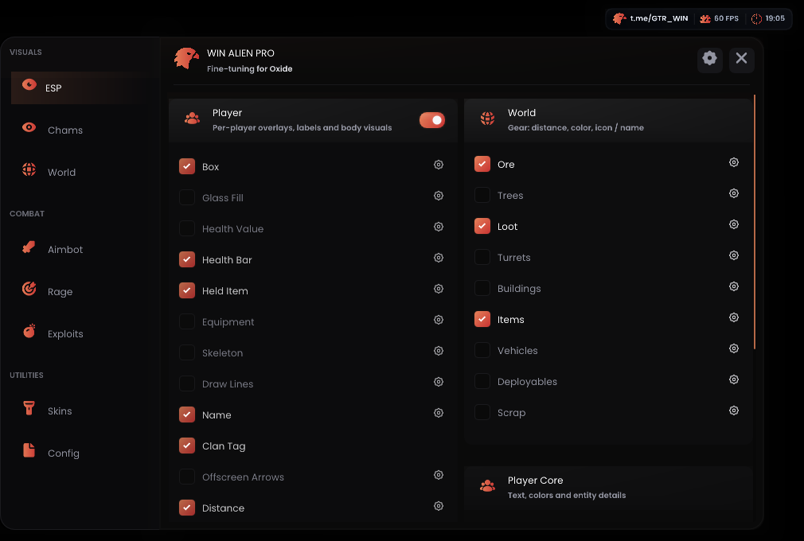
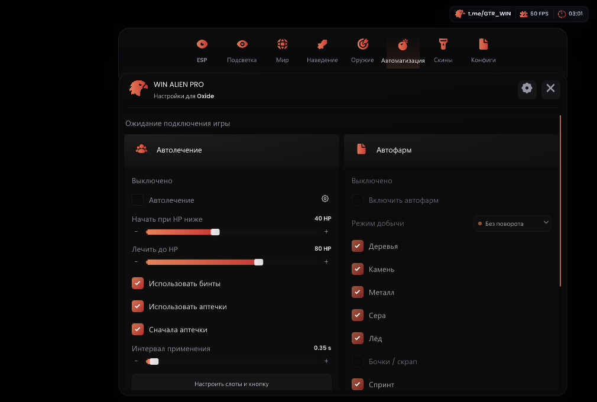
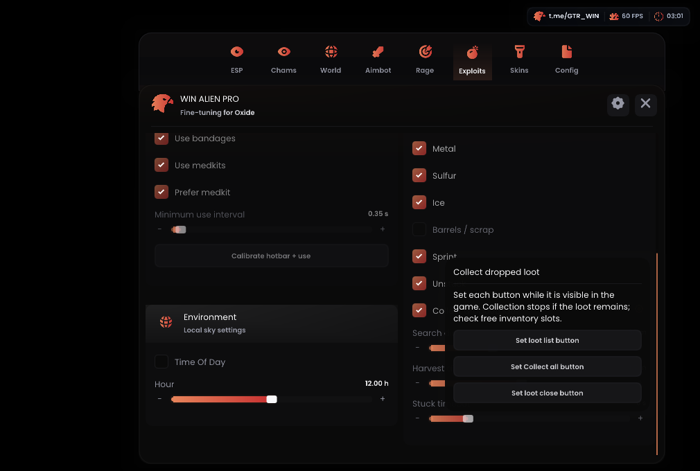
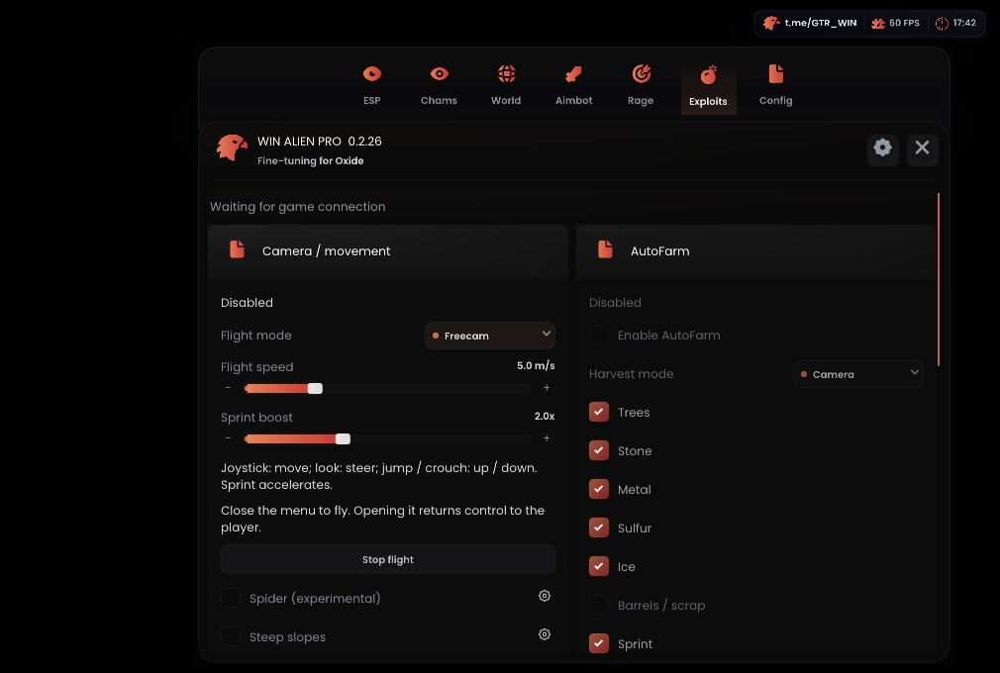

# WIN ALIEN — Oxide external

**0.2.27 для Oxide 1.13.11940** — [релиз и файлы](https://github.com/asiriswin-bit/WINALIEN-Oxide-External/releases/tag/oxide-11940-v0.2.27).

[Скачать онлайн-лоадер](https://github.com/asiriswin-bit/WINALIEN-Oxide-External/releases/download/oxide-11940-v0.2.27/OxideExternal-11940-Online.zip) · [Только EXE](https://github.com/asiriswin-bit/WINALIEN-Oxide-External/releases/download/oxide-11940-v0.2.27/OxideLoader.exe) · [Офлайн-пакет](https://github.com/asiriswin-bit/WINALIEN-Oxide-External/releases/download/oxide-11940-v0.2.27/OxideExternal-11940-PC.zip)

Остановите старый runtime, распакуйте Online ZIP в новую папку и запустите `OxideLoader.exe`. Бинарники и ADB скачиваются с GitHub с проверкой размера и SHA-256. Старый EXE закреплён за прежним релизом: для перехода нужен новый. Не переносите пустой `github-repository.txt` из офлайн-пакета — он отключает загрузки.

Обновлены профили ARM64 и x86_64 под 11940. Внесены правки переключения целей Silent, автофарма и управления Freecam/Noclip; добавлены выбор инструмента, параметры бега/прыжка и быстрых ударов, bunnyhop/autostrafe. Clumsy находится в Exploits. Исправлено масштабирование текста и слайдеров. Новые функции выключены по умолчанию, пользовательские CFG сохраняются.

Для автоматического выбора топора и кирки включите настройку AutoFarm и укажите первый и последний слот панели. Подбор лута требует трёх отдельных точек: открыть список, собрать всё, закрыть список. Auto Heal требует калибровки слотов и кнопки применения лекарства. Полная инструкция — в описании релиза и `docs/release-0.2.27.md` внутри архивов.

Проверки: 30/30 host-тестов, 16/16 JVM-тестов, отдельная сверка профилей обеих архитектур, визуальная проверка меню при 180% и успешная загрузка через GitHub с пустым кэшем. Это предварительная сборка, в игре она ещё не проверена.

Wallshot не реализован. Анимация Melee остаётся; Noclip не отменяет серверные откаты, Clumsy не гарантирует принятие урона. Скинченджер, проверка видимости, удалённые HP и Spider отключены. Внутренний модуль не загружается.

[Исходники текущей сборки](https://github.com/asiriswin-bit/WINALIEN-Oxide-External/releases/download/oxide-11940-v0.2.27/OxideExternal-11924-source.zip) сохраняют старое имя архива, внутри код 11940. Телефонный APK 0.1.7 остаётся отдельной локальной поставкой.

Русский язык: **Settings → Language → Русский**. Изображения ниже показывают интерфейс предыдущей сборки на синтетических сценах.

