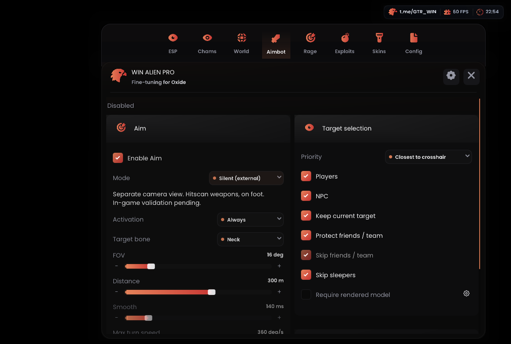

# WIN ALIEN — Oxide External

**0.2.17 · Oxide 1.13.11924 x86_64 · MSI App Player / BlueStacks**

[Скачать лоадер](https://github.com/asiriswin-bit/WINALIEN-Oxide-External/releases/latest/download/OxideLoader.exe) · [Релиз 0.2.17](https://github.com/asiriswin-bit/WINALIEN-Oxide-External/releases/tag/oxide-11924-v0.2.17)

## Версия 0.2.17

Реализован **Silent (external)** через отдельную матрицу Unity Camera и штатные углы MouseLook. Пользовательский ракурс отделён от направления наведения. Поддерживаются выбор кости, FOV, дальность, игроки и NPC. **Попадания в живой игре ещё не подтверждены.** Эта сборка предназначена для проверки новой реализации у тестера.

Внутренняя `.so`, injector и hooks не загружаются. Silent предназначен для hitscan-оружия и игрока пешком. При отключении, потере цели, смене оружия или открытии меню восстанавливается обычная камера. Aim по умолчанию выключен, режим — Camera.

## Обновление и проверка

1. Останови external, полностью закрой игру и старый лоадер. Ранее загруженный внутренний модуль остаётся до завершения процесса игры.
2. Замени EXE на 0.2.17 и нажми «Скачать файлы». Дождись runtime `oxide-11924-v0.2.17`. Обновление runtime не заменяет сам EXE. В полном PC ZIP уже лежат соответствующие файлы.
3. Aim → Enable Aim → Mode: **Silent (external)** → Activation: **Always**. Для первой проверки: FOV 20–30°, Head или Chest, остальные изменения оружия выключены. Не включай Require rendered model и прежнее требование physics sight.
4. Сначала проверь мышь, ходьбу и восстановление камеры при выключении. Затем проверь обычной стрельбой цель внутри круга, сбоку от центра. Сохрани runtime log и видео фактических попаданий/урона.

`External Silent active; hit not confirmed` означает успешные записи матрицы и углов, а не попадание. Журнал содержит `silent_view active=... phase=... shot_confirmed=0`.

## Проверка и ограничения

18/18 локальных CTest, полная сборка Windows/Android, сверка getter/setter/reset с точным libunity.so, проверка меню при 100%/150%, проверка ELF и отсутствия загрузки internal. Тесты включают математическую модель камеры, учёт ввода и восстановление после частичных записей. Они не воспроизводят Unity scheduler или сервер.

Внешние записи не атомарны относительно игрового кадра. Поведение оружия, движения, ADS, culling и реальных попаданий требует проверки на эмуляторе. Принудительное завершение external может оставить ручную матрицу до перезапуска игры. Отсутствие `.so` не является антибаном.

Render visibility остаётся приблизительным сигналом отрисовки, а не физическим wallcheck. Silent не добавляет стрельбу через стены, Silent Farm/Melee или свободную камеру. AutoFarm использует прямое движение без поиска пути; Auto Melee — обычную атаку.

Репозиторий содержит описание и бинарники. Исходники соответствующей сборки находятся в отдельном архиве у владельца проекта. Ресурсы и адаптер поверхности исходного Overlay — GPLv3, Dear ImGui — MIT. Исторические исходники internal используют Dobby — Apache-2.0. См. [THIRD-PARTY-NOTICES.txt](THIRD-PARTY-NOTICES.txt).
